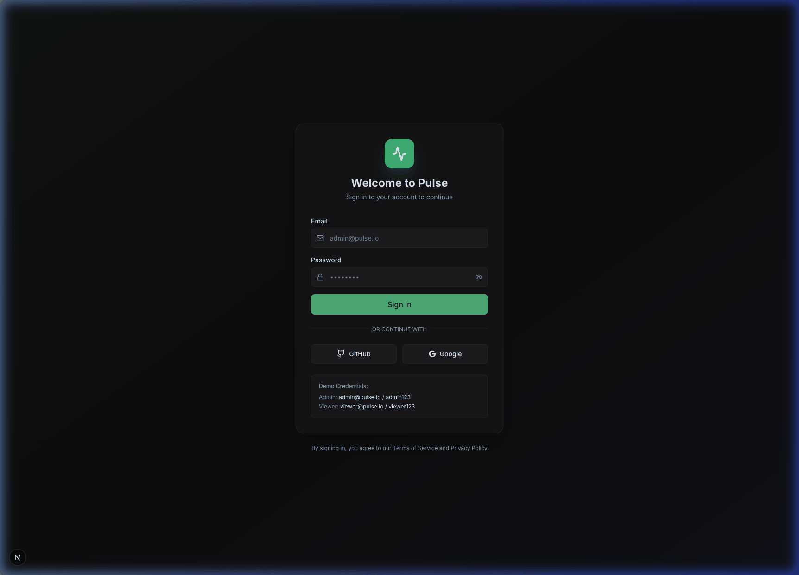

<p align="center">
  
</p>

<h1 align="center">Pulse</h1>

<p align="center">
  <strong>AI-Powered Observability Platform for Modern Infrastructure</strong><br>
  <a href="https://github.com/sponsors/h18n">
    
  </a>
</p>

<p align="center">
  
</p>

<p align="center">
  <a href="https://h18n.github.io/pulse/">Live Demo Website</a> •
  <a href="#features">Features</a> •
  <a href="#quick-start">Quick Start</a> •
  <a href="docs/GETTING_STARTED.md">Getting Started</a> •
  <a href="#architecture">Architecture</a> •
  <a href="CONTRIBUTING.md">Contributing</a>
</p>

<p align="center">
  
  
  
</p>

---

## 🚀 What is Pulse?

**Pulse** is a next-generation, AI-powered observability platform that unifies metrics, logs, traces, and incidents into a single pane of glass. Built for modern DevOps, SRE, and Platform Engineering teams, Pulse reduces Mean Time to Resolution (MTTR) by 75% through intelligent automation and an AI copilot.

### Why Pulse?

| Pain Point | Pulse Solution |
|------------|-------------------|
| 😫 Alert fatigue (70% non-actionable) | 🤖 AI-powered anomaly detection |
| 🔀 Tool sprawl (5-8 tools per org) | 📊 Unified platform for all telemetry |
| ⏱️ Slow investigations (4+ hours MTTR) | ⚡ AI Copilot for instant root cause |
| 💸 Unpredictable costs | 💰 Predictable per-host pricing |

---

## ✨ Features

### 📊 Unified Dashboards
- Grafana-style view/edit with drag-and-drop panel layout
- 12+ visualization types (Stats, Charts, Tables, Gauges, etc.)
- Real-time auto-refresh, template variables, sharing & permissions

### 🔍 Explore
- **Logs Explorer**: Full-text search, live tailing, structured logging
- **Metrics Explorer**: PromQL query builder with multi-query support
- **Global Query Explorer**: Cross-region Thanos queries

### 🚨 Alerting & Incidents
- Threshold and anomaly-based alerts with correlation rules engine
- Multi-channel notifications (Slack, PagerDuty, Email, Webhooks)
- Incident timeline and war room collaboration

### 🤖 AI Copilot & Automation
- Natural language queries ("Show me errors in checkout service")
- Automated root cause analysis & remediation suggestions
- Runbook automation with step-by-step execution

### 📡 Native OpenTelemetry
- Ingest Metrics, Logs, and Distributed Traces natively via OTLP.
- No vendor lock-in (`otel-collector` runs as a sidecar).
- Turnkey integration for Node.js, Python, Go, and Java.

### 🖥️ Infrastructure Monitoring
- Device inventory, auto-discovered service map
- Resource utilization (CPU, Memory, Disk, Network)
- MQTT sensor integration for IoT monitoring

### 🎨 Beautiful UX
- "Hacker Chic" dark theme with glassmorphism effects
- Fully responsive, WCAG 2.1 AA accessible
- Command Palette (⌘K) for quick navigation

---

## 🏁 Quick Start

> For a comprehensive setup guide, see **[Getting Started](docs/GETTING_STARTED.md)**.

### Prerequisites

- **Node.js** 20+ and npm
- **Docker & Docker Compose** (for backend infrastructure)
- **Google AI API key** ([get one here](https://aistudio.google.com/apikey))

### 1. Clone & Configure

```bash
git clone https://github.com/h18n/pulse.git
cd pulse

# Copy environment templates
cp .env.example .env
cp ui/.env.example ui/.env.local

# Edit .env and add your GEMINI_API_KEY
```

### 2. Start Services via Docker Compose (Recommended)

Start the entire Pulse stack (UI and Backend Services) with one command.

```bash
docker-compose up -d
```
Open [http://localhost:3000](http://localhost:3000) in your browser.

### Alternative: Local Development

If you prefer to run services manually for development, we've bundled everything into a single command using `concurrently`!

```bash
# Terminal 1 - Background Infra (if any)
npm run infra:up

# Terminal 2 - Start all 4 services at once
# (Installs all dependencies across the workspace first)
npm run install:all
npm run dev
```

Open [http://localhost:3000](http://localhost:3000) in your browser.

### Demo Credentials

| Role | Email | Password |
|------|-------|----------|
| Admin | admin@pulse.io | admin123 |
| Viewer | viewer@pulse.io | viewer123 |

> ⚠️ These are demo-only credentials. See [auth.ts](ui/src/lib/auth.ts) for how to replace with a real database.

---

## 📁 Project Structure

```
pulse/
├── ui/                          # Next.js Frontend (port 3000)
│   ├── src/
│   │   ├── app/                 # App Router pages
│   │   │   ├── (dashboard)/     # Dashboard route group
│   │   │   │   ├── dashboards/  # Dashboard CRUD pages
│   │   │   │   ├── alerts/      # Alert & correlation rules
│   │   │   │   ├── automation/  # Runbook automation
│   │   │   │   ├── copilot/     # AI Copilot
│   │   │   │   ├── devices/     # Infrastructure & sensors
│   │   │   │   ├── explore/     # Logs, metrics, global queries
│   │   │   │   └── incidents/   # Incident management
│   │   │   ├── api/             # API routes
│   │   │   └── login/           # Authentication
│   │   ├── components/          # Reusable UI components
│   │   ├── lib/                 # Utilities & services
│   │   └── stores/              # Zustand state management
│   └── .env.example             # UI environment template
│
├── apps/                        # Backend microservices
│   ├── ai-engine/               # AI/ML Engine (port 3002)
│   ├── alert-ingestion/         # Alert processing (port 3001)
│   ├── config-manager/          # Configuration service (port 3003)
│   └── slack-pacer/             # Slack bot integration
│
├── infra/                       # Infrastructure
│   ├── docker-compose.yml       # Local dev environment
│   ├── prometheus/              # Prometheus config
│   └── telegraf/                # Telegraf config
│
├── docs/                        # Documentation
│   ├── GETTING_STARTED.md       # Beginner setup guide
│   ├── PRD.md                   # Product Requirements
│   ├── DESIGN_SYSTEM.md         # Design System Guide
│   ├── API_SPECIFICATION.md     # API Reference
│   └── TESTING_STRATEGY.md      # Testing Framework
│
├── .env.example                 # Root environment template
├── ARCHITECTURE.md              # System architecture
├── CONTRIBUTING.md              # Contribution guidelines
├── CODE_OF_CONDUCT.md           # Code of Conduct
├── LICENSE                      # Apache 2.0
└── README.md                    # This file
```

---

## 🏗️ Architecture

```
┌─────────────────────────────────────────────────────────────────────────┐
│                              CLIENTS                                     │
│   ┌──────────┐    ┌──────────┐    ┌──────────┐                          │
│   │   Web    │    │  Mobile  │    │   CLI    │                          │
│   │   App    │    │   App    │    │   Tool   │                          │
│   └────┬─────┘    └────┬─────┘    └────┬─────┘                          │
└────────┼───────────────┼───────────────┼────────────────────────────────┘
         │               │               │
         └───────────────┼───────────────┘
                         ▼
┌─────────────────────────────────────────────────────────────────────────┐
│                     APPLICATION LAYER                                    │
│  ┌──────────────┐  ┌──────────────┐  ┌──────────────┐                  │
│  │ Alert Ingest │  │  AI Engine   │  │Config Manager│                  │
│  │   (3001)     │  │   (3002)     │  │   (3003)     │                  │
│  └──────┬───────┘  └──────┬───────┘  └──────┬───────┘                  │
└─────────┼─────────────────┼─────────────────┼──────────────────────────┘
          │                 │                 │
          └─────────────────┼─────────────────┘
                            ▼
┌─────────────────────────────────────────────────────────────────────────┐
│                           DATA LAYER                                     │
│  ┌────────────┐   ┌────────────┐   ┌────────────┐                      │
│  │ Prometheus │   │Elasticsearch│  │  Telegraf  │                      │
│  │   (9090)   │   │   (9200)    │  │   (9273)   │                      │
│  └────────────┘   └────────────┘   └────────────┘                      │
└─────────────────────────────────────────────────────────────────────────┘
```

### Tech Stack

| Layer | Technology |
|-------|------------|
| **Frontend** | Next.js 15, React 19, TypeScript, Tailwind CSS |
| **UI Components** | shadcn/ui, Lucide Icons, Recharts |
| **State Management** | Zustand, React Hooks |
| **Real-time** | WebSocket, MQTT integration |
| **Authentication** | NextAuth.js |
| **Backend** | Fastify, TypeScript, Slack Bolt |
| **AI** | Google Gemini 2.0 Flash |
| **Databases** | Prometheus, Elasticsearch |
| **Infrastructure** | Docker, Docker Compose |

---

## 📖 Documentation

| Document | Description |
|----------|-------------|
| [Getting Started](docs/GETTING_STARTED.md) | Step-by-step setup guide for beginners |
| [Architecture](ARCHITECTURE.md) | System architecture details |
| [PRD](docs/PRD.md) | Product Requirements Document |
| [Design System](docs/DESIGN_SYSTEM.md) | UI components, colors, typography |
| [API Specification](docs/API_SPECIFICATION.md) | REST API reference |
| [Testing Strategy](docs/TESTING_STRATEGY.md) | Testing frameworks and patterns |
| [Instrumentation](docs/INSTRUMENTATION.md) | OpenTelemetry instrumentation recipes |

---

## 🧪 Testing

```bash
cd ui

# Run all tests
npm run test

# Unit tests with coverage
npm run test:coverage

# E2E tests
npm run test:e2e

# Lint & type check
npm run lint
npm run type-check
```

---

## 🤝 Contributing

We welcome contributions! Please see our [Contributing Guide](CONTRIBUTING.md) for details.

1. Fork the repository
2. Create a feature branch (`git checkout -b feature/amazing-feature`)
3. Commit your changes (`git commit -m 'feat: add amazing feature'`)
4. Push to the branch (`git push origin feature/amazing-feature`)
5. Open a Pull Request

---

## 📊 Roadmap

### ✅ Completed
- Unified dashboards with drag-drop, resize, sharing
- Logs & Metrics explorers with Thanos global queries
- AI Copilot with natural language queries
- Automated Root Cause Analysis (ARCA)
- Correlation rule engine & runbook automation
- MQTT sensor integration
- Service map with interactive topology

### 🔄 In Progress
- Multi-region deployment
- Trace Explorer
- AI Copilot v2 (Actions)

### 📋 Planned
- SLO Dashboard & anomaly detection
- Custom plugin system
- SSO/SAML & audit logging
- Terraform provider

---

## 📄 License

This project is licensed under the Apache License 2.0 — see the [LICENSE](LICENSE) file for details.

---

## 🙏 Acknowledgments

- [shadcn/ui](https://ui.shadcn.com/) for the beautiful component library
- [Lucide](https://lucide.dev/) for the icon set
- [Tailwind CSS](https://tailwindcss.com/) for the utility-first CSS framework
- [Next.js](https://nextjs.org/) for the React framework

---

<p align="center">
  Made with ❤️ by the Pulse Contributors
</p>
